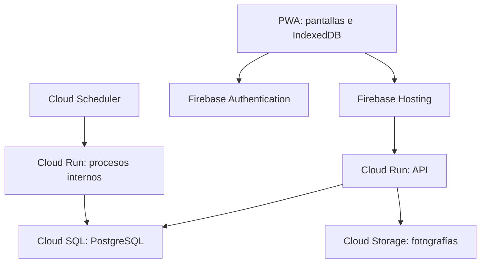

# 03 — ShiftTrack 2.0: diseño técnico

**Versión:** 1.0.  
**Fecha:** 3 de octubre de 2026.  
**Base funcional:** documento 02, «ShiftTrack 2.0: especificación maestra», versión 1.0.  
**Referencia existente:** `cesar04610/shifttrack`, commit `2cf7a06afcce071fbdc02e7e4aeff2a738bca090`.  
**Estado:** arquitectura propuesta para implementación. No hay servicios creados ni pruebas ejecutadas.  
**Autoridad:** los requisitos aprobados del documento 02 prevalecen sobre las propuestas de este documento.

## 1. Decisión de arquitectura

Construir una aplicación web instalable como PWA con React, TypeScript y Vite, publicada en Firebase Hosting. Usar una API Node.js/Express en Cloud Run, PostgreSQL en Cloud SQL, Firebase Authentication para sesiones conectadas y Cloud Storage para fotografías.

El trabajo sin Internet se implementará con almacenamiento local IndexedDB y una cola de operaciones explícita. No dependerá de que una sesión de Firebase o una caché de documentos resuelva el relevo offline y las reglas financieras.

La propuesta conserva la naturaleza relacional de ShiftTrack: empleado, horario, fichaje, tarea, pago, turno, corte y movimiento tienen relaciones y necesitan operaciones atómicas. PostgreSQL permite expresar esas relaciones sin convertirlas a documentos. Es una decisión de diseño de este proyecto.

Firebase Hosting admite servir una API de Cloud Run y Cloud Run puede conectarse con Cloud SQL PostgreSQL [S1, S2]. No se usará Firebase SQL Connect en la primera versión: la API será la única entrada a los datos, para centralizar permisos, cierres y sincronización. No crear una segunda ruta de escritura directa desde el navegador.

Firestore no será la base de datos de esta versión. Su documentación describe persistencia offline y resolución por última escritura para cambios sobre un mismo documento [S3]; eso no sustituye las reglas específicas de entrega de caja, orden de movimientos y correcciones diseñadas aquí.



En el diagrama, Hosting entrega la aplicación y reenvía las solicitudes API. Cuando no hay conexión, la PWA cargada previamente trabaja con su almacenamiento local; los procesos de la nube no conocen esos nuevos movimientos hasta sincronizar.

## 2. Servicios y límites de responsabilidad

- **Firebase Hosting:** archivos compilados, HTTPS y reenvío `/api/**` hacia la API. El service worker conserva la interfaz necesaria para abrirla sin Internet.
- **Firebase Authentication:** identidad y tokens de sesión conectada. El nombre/contraseña se valida inicialmente en la API mediante autenticación personalizada [S4].
- **Cloud Run API:** autenticación inicial, permisos, operaciones del negocio, reportes, exportaciones, sincronización y autorización de fotografías.
- **Cloud SQL PostgreSQL:** datos autoritativos, relaciones, restricciones, transacciones, auditoría y registro de operaciones procesadas.
- **Cloud Storage:** imágenes privadas. La aplicación guarda una referencia al objeto, no una imagen dentro de la base SQL.
- **Cloud Run worker privado:** procesos periódicos y envío de correos pendientes.
- **Cloud Scheduler:** invoca procesos internos autenticados mediante cuenta de servicio/OIDC [S5]. No ejecutar `node-cron` en cada instancia de la API.
- **Secret Manager:** credenciales SMTP, secretos de conexión y material de firma cuando corresponda; Cloud Run integra secretos de este servicio [S6].

Un solo backend modular para la primera versión. No dividir proveedores, cortes y tesorería en servicios independientes: el cierre y su efecto financiero deben poder confirmarse en una misma transacción.

## 3. Organización del proyecto

```text
apps/web/                 React, pantallas, PWA y almacenamiento local
apps/api/                 Express, módulos, permisos y sincronización
apps/worker/              Entradas de procesos periódicos
packages/contracts/       Tipos, validaciones y contratos compartidos
packages/domain/          Reglas puras: importes, fechas, cortes y saldos
packages/database/        SQL, consultas y migraciones versionadas
infra/                    Configuración de despliegue e infraestructura
tests/                    Integración, permisos, offline y pruebas de interfaz
docs/                     Documentos 01, 02, 03 y contratos OpenAPI
```

La estructura es una propuesta de carpetas, no un repositorio creado. Compartir validaciones cliente/servidor, pero el servidor sigue siendo responsable de autorizar y recalcular.

Separar cada módulo en rutas, servicios de aplicación y consultas. Las rutas no ejecutan fórmulas financieras dispersas. Fijar versiones de dependencias y runtime en el archivo de bloqueo cuando comience la implementación; verificarlas entonces contra su documentación vigente.

## 4. Modelo de datos relacional

### 4.1 Convenciones

- Identificadores UUID generables en el cliente para entidades que se crean offline.
- Dinero en `BIGINT` con centavos MXN. En JSON, cadenas enteras como `"150000"`; no usar números flotantes para importes ni convertir un BIGINT sin comprobar el rango.
- Tiempos reales en `TIMESTAMPTZ` UTC. `business_date DATE` calculada para la zona IANA de cada sucursal.
- `occurred_at`: instante atribuido a la captura; `received_at`: recepción en la nube; `time_quality`: origen/certeza del reloj. Guardar ambos para offline.
- `branch_id NOT NULL` en datos operativos; `version BIGINT` en entidades editables.
- Bajas lógicas para empleados/proveedores/categorías según sus reglas. Auditoría y movimientos financieros no se borran para corregirlos.
- Referencias entre entidades operativas mediante clave compuesta `(branch_id, id)` para impedir relaciones entre sucursales.
- Registros históricos conservan `actor_user_id` y nombre de presentación al capturar, para que cambios de nombre no pierdan atribución.

### 4.2 Identidad y configuración

- `branches`: nombre, zona horaria, activa, fecha de arranque.
- `users`: `firebase_uid`, `username`, `username_normalized`, nombre, rol, `branch_id`, activa, `auth_version` y fecha de desactivación. Superadministrador no queda limitado a una sola sucursal; los otros roles requieren sucursal.
- `password_credentials`: `user_id`, hash Argon2id, parámetros del hash y fecha de cambio. Solo la API de autenticación accede a esta tabla; nunca se devuelve al navegador.
- `registers`: sucursal, número/nombre y activa. Unicidad de número por sucursal.
- `branch_supplier_config`: sucursal, `register_id`, `device_id` y `assignment_epoch`. Un equipo y una caja proveedores por sucursal.
- `devices`: clave pública, sucursal, caja asignada, nombre, estado autorizado/revocado y versión. Registro online por superadministrador.
- `device_user_grants`: empleado, equipo, emisión, expiración, versión de credenciales/permisos, clave pública de firma del empleado en ese equipo y concesión firmada.
- `alert_config`, `cuts_config`, `email_config`, `email_recipients`: configuraciones separadas por sucursal. La contraseña SMTP es referencia a secreto, no texto dentro de una respuesta o tabla de configuración.

**Decisión técnica:** `username_normalized` es único en toda la aplicación. Esto permite identificar sucursal con solo usuario/contraseña sin un selector inicial. Proponer sufijos al crear un nombre ocupado; el nombre de presentación puede repetirse. No importar nombres duplicados silenciosamente.

### 4.3 Personal y tareas

- `schedules`: empleado, fecha, inicio y fin. Conservar capacidad actual; no añadir restricciones de solapamiento que cambien la operación sin aprobación.
- `clock_records`: empleado, horario opcional, entrada/salida, ubicación de entrada opcional y duración. Índice único parcial de entrada abierta por sucursal/empleado/fecha.
- `task_catalog`: plantilla, prioridad, descripción, creador y activa.
- `task_assignments`: plantilla, empleado, recurrencia única/diaria/semanal, días y fecha inicial.
- `task_instances`: asignación, empleado, fecha, estado, finalización, nota y referencia a evidencia. Unicidad `(branch_id, assignment_id, due_date)`.
- `task_summary_log`: fecha/sucursal, intento y estado; no confundir intento con entrega.
- `product_shortages`: producto, nota, autor y fecha. Conservar permisos actuales de lista y limpieza dentro de la sucursal.

Una asignación retirada se desactiva; sus instancias históricas permanecen. Una reversión administrativa de tarea se audita. Esta conservación implementa la trazabilidad sin imponer una foto obligatoria.

### 4.4 Proveedores y cierres

- `suppliers`: empresa, representante, teléfono, tipo de producto, activo y versión.
- `supplier_daily_sessions`: caja proveedores, fecha, saldo inicial y cierre diario opcional; única por sucursal/caja/fecha.
- `supplier_shifts`: sesión, responsable, equipo, apertura, saldo recibido, esperado, contado, diferencia y cierre. Como máximo un turno proveedor abierto por sucursal/caja.
- `supplier_events`: eventos ordenados de apertura, adición, pago, anulación antes del cierre, cierre, entrega y ajuste. Contienen importe, turno, autor, operación origen y `device_seq` cuando corresponde.
- `purchase_tickets`: proveedor, turno, importe, nota, momento original, estado de anulación y motivo. No reescribir el importe original después del cierre.
- `supplier_corrections`: original, tipo de rectificación/devolución, monto, motivo, autorizador y evento financiero compensatorio.
- `supplier_shift_changes`: saliente/entrante y vínculo al cierre y apertura nuevos. No compartir credenciales.
- `ticket_alerts`: promedio de referencia, muestras, desviación, estado visto y entrega de correo.

El cierre es el reinicio explícito del saldo proveedor esperado: `saldo nuevo = último contado + adiciones posteriores − pagos posteriores + ajustes posteriores`. No sumar el saldo contado como si fuera un ingreso nuevo del negocio.

### 4.5 Cortes y tesorería

- `cash_register_cuts`: empleado, caja, horario opcional, fecha, etiqueta Mañana/Tarde, ventas, tarjeta, contado, esperado y diferencia. Unicidad `(branch_id, employee_id, business_date, shift_label)` como se acordó, sin añadir caja a esa regla.
- `cut_baselines`: empleado/caja/día de semana, promedio y muestras.
- `cut_alerts`, `cut_alert_log`: anomalías, cortes faltantes, vistos y deduplicación.
- `expense_categories`: categorías activas por sucursal.
- `treasury_movements`: entradas originales de inicialización, gasto, retiro de banco, ajuste y correcciones según autorización.
- `treasury_entries`: efectos sobre efectivo/banco con `source_type`, `source_id`, `effect_kind`, importe y fecha. Unicidad por fuente/tipo de efecto; una repetición de sincronización no genera otro asiento.
- `financial_openings`: inicio de operación con efectivo total, parte asignada a proveedores y saldo bancario.

### 4.6 Infraestructura de sincronización y auditoría

- `processed_operations`: UUID de operación, hash de solicitud, estado, respuesta original y efecto confirmado.
- `device_streams`: última secuencia aceptada, época de asignación y versión de caja.
- `change_feed`: cursor creciente por sucursal, tipo/entidad/versión y bajas para actualizar cachés.
- `media_objects`: objeto Storage, tarea, sucursal, tamaño, tipo, hash y estado.
- `audit_events`: actor, sucursal, dispositivo, acción, referencia, versiones y fechas.
- `notification_outbox`: notificación, destinatarios, reintentos, siguiente intento y estado.

### 4.7 Restricciones y aislamiento

Cada consulta recibe contexto de autorización derivado por la API, nunca un `branch_id` confiado libremente. En PostgreSQL usar políticas RLS como defensa adicional [S7], con cuenta de ejecución sin propiedad de tablas ni `BYPASSRLS`; considerar `FORCE ROW LEVEL SECURITY` en tablas operativas. Las migraciones utilizan una cuenta separada.

Establecer contexto mediante `SET LOCAL` dentro de una transacción por petición para no contaminar conexiones del pool. El superadministrador opera sobre la sucursal validada que seleccionó. Identidad/configuración global exige rutas específicas; no habilitar bypass global en una consulta común.

Comprobar también los padres de cada referencia. Obtener una tarea, fotografía o pago por UUID no debe eludir el ámbito de sucursal.

## 5. Autenticación conectada y permisos

### 5.1 Inicio de sesión

1. `POST /api/v1/auth/login` recibe nombre/contraseña y, automáticamente, identidad del dispositivo si está registrado.
2. Normalizar nombre, limitar intentos y responder con error genérico ante credenciales inválidas.
3. Verificar hash Argon2id y cuenta activa en PostgreSQL.
4. Emitir custom token de Firebase; el navegador lo intercambia con `signInWithCustomToken` [S4].
5. Para cada petición conectada, verificar ID token con Admin SDK y consultar rol/sucursal/estado/versión actuales. No aceptar el custom token como token API [S8].
6. Resolver contexto de caja desde el equipo registrado. En un dispositivo personal sin caja, permitir acceso administrativo; un empleado elige caja después del login si el equipo no fija una, y necesita equipo designado para proveedores.

Solo se muestran usuario y contraseña en la pantalla inicial. No añadir correo como requisito al empleado. UID estable de Firebase y UUID de usuario se vinculan explícitamente.

Claims pueden acelerar presentación, pero no sustituyen la consulta autoritativa de permiso. Desactivación/cambio de rol incrementa `auth_version` y revoca sesiones Firebase donde corresponda [S9]. Proteger al último superadministrador activo de una desactivación accidental.

Primer dueño: procedimiento administrativo de arranque ejecutado una vez, sin contraseña predeterminada incrustada. Crear usuarios requiere conexión; las cuentas normales solo se crean en la sucursal del administrador.

### 5.2 Permisos implementables

- Superadministrador: permisos administrativos en sucursal seleccionada, configuración de sucursales/cajas/equipos y creación de todos los roles.
- Administrador: permisos administrativos actuales de su sucursal, cuentas normales y correcciones autorizadas. No creación de administradores ni ascenso propio.
- Usuario normal: pantallas actuales; recursos personales en tareas, fichajes y cortes; faltantes dentro de su sucursal; proveedores/pagos/adiciones solo en contexto de caja proveedores autorizada.
- Fotos: dueño de la tarea o administrador/superadministrador de esa sucursal, sin enlaces públicos permanentes.

No convertir el rol administrador en permiso para capturar automáticamente toda operación del empleado: conservar la separación funcional del documento 02.

## 6. PWA y datos locales

IndexedDB almacena datos estructurados y archivos/blobs [S10]. Separar las siguientes stores:

- `device`: identidad, claves, época de asignación y versión de aplicación.
- `user_grants`: concesiones firmadas y claves de empleado protegidas.
- `branch_cache`: configuración necesaria; horarios propios, tareas, proveedores, sesión y saldos relevantes.
- `outbox`: comandos, dependencias, secuencia, firma y estado.
- `media_outbox`: blobs de fotografías pendientes.
- `sync_cursor`: último cambio incorporado y confirmaciones del servidor.

Cada escritura local modifica proyección visible y cola en una transacción IndexedDB. Mostrar éxito solamente cuando ambas quedaron guardadas. En falta de espacio, mostrar error y no confirmar captura.

Solicitar almacenamiento persistente con `navigator.storage.persist()` y verificar `estimate()`. Su concesión depende del navegador; datos locales siguen siendo borrables por el usuario y no sustituyen un respaldo [S11]. Usar Chrome/Edge estables de escritorio como primera plataforma a validar; no operar caja offline en navegación privada.

El service worker conserva HTML, JS y CSS versionados. No cachear respuestas autenticadas indiscriminadamente. La aplicación mantiene sus cachés por sucursal y filtra por usuario en el repositorio local. Cambiar de usuario oculta información ajena sin borrar pendientes del equipo.

Actualizar service worker/migraciones locales sin borrar outbox. Si hay operaciones pendientes, posponer una actualización incompatible y avisar. No depender de Background Sync: sincronizar al abrir, volver al foco y recuperar conexión, con temporizador mientras la aplicación esté abierta. Con el navegador cerrado no prometer envíos inmediatos.

## 7. Acceso offline durante ocho horas

### 7.1 Distinción esencial

La persistencia de sesión Firebase no es un verificador offline de contraseñas de otros empleados. Diseñar esta capacidad expresamente. Un custom token tampoco se reutiliza como concesión offline.

Tras una validación real en línea, emitir una concesión firmada por el servidor con:

```json
{
  "grant_id": "uuid",
  "user_id": "uuid",
  "branch_id": "uuid",
  "device_id": "uuid",
  "auth_version": 3,
  "permissions_version": 1,
  "issued_at": "instante-servidor",
  "expires_at": "issued_at-mas-8-horas",
  "allowed_commands": ["task.complete", "cut.create", "supplier.ticket.create"],
  "user_device_public_key": "clave-publica"
}
```

La lista real se deriva del usuario/caja y contiene únicamente comandos admitidos. El servidor guarda la concesión y el cliente verifica su firma con clave pública. Los ocho horas pertenecen a cada combinación empleado/equipo, no a una sesión global de caja.

### 7.2 Preparación de la contraseña sin guardarla en texto

Cada empleado autorizado inicia sesión en línea en ese equipo al prepararlo. No descargar hashes de contraseñas de los demás empleados.

En ese login, el navegador crea un par de claves de firma por empleado/equipo y registra su pública mediante la API autenticada. Cifra la clave privada y un bloque de prueba aleatorio con AES-GCM, usando clave derivada de la contraseña mediante PBKDF2, sal aleatoria y parámetros persistidos. Web Crypto ofrece derivación de claves [S12]. Calibrar iteraciones durante el prototipo; no reutilizar sal/nonce ni almacenar la contraseña.

Al ingresar offline, descifrar el bloque y la clave permite comprobar la contraseña local y firmar comandos. Una clave equivocada no debe producir login. Bloquear nuevos intentos temporalmente tras fallos repetidos; borrar claves de empleado de memoria al salir, no la outbox.

Este mecanismo es una propuesta que debe pasar revisión y pruebas. Una contraseña débil sigue expuesta a intentos si alguien extrae el almacenamiento. Un navegador/equipo controlado por un atacante no proporciona atribución inviolable. La firma protege integridad y la asociación con una concesión, no prueba físicamente quién estaba ante el teclado.

### 7.3 Tiempo y vencimiento

No renovar por un heartbeat de dispositivo ni por conectividad aparente. La renovación debe verificar en el servidor la identidad actual del empleado, estado activo y versiones; el primer preparado o cambio de contraseña requiere validación de contraseña. No renovar autorizaciones de empleados que no se hayan validado individualmente.

Usar hora del servidor como ancla, tiempo monotónico durante ejecución y última hora local máxima persistida al reiniciar. Si el reloj retrocede o no puede estimarse una hora confiable, bloquear nuevas capturas y pedir conexión. Un entorno web no ofrece un reloj offline inviolable ante manipulación privilegiada: las ocho horas son un control operativo probado contra cambios ordinarios, no una garantía contra dueño malicioso del dispositivo.

Al vencer se impiden nuevos comandos autenticados, incluido un nuevo cierre, pero nunca se eliminan pendientes. Mostrar aviso antes del vencimiento para cerrar a tiempo. Al validar otra vez en línea, recuperar pendientes y resolver un cierre que hubiera quedado abierto según CIE-02.

## 8. Exclusividad de caja proveedores y relevos

### 8.1 Un único escritor designado

Para la versión 1, todas las operaciones ordinarias de saldo proveedores, tanto online como offline, se originan en el equipo designado. Los administradores pueden consultar remotamente; una corrección que afecta ese saldo requiere que el equipo esté conectado, sincronizado y confirme la nueva versión antes de seguir.

Esto es una decisión técnica para evitar dos saldos independientes. Si el equipo autorizado está offline, no transferir automáticamente su autorización a otro al cumplirse ocho horas: la concesión del empleado puede vencer, pero los movimientos pendientes del equipo siguen existiendo.

Corrección remota con protocolo de pausa: solicitar al equipo que detenga nuevas capturas, vacíe su cola y confirme última secuencia/versión; dentro de transacción bloquear la caja y aplicar compensación; entregar versión nueva al equipo y esperar confirmación antes de reanudar. Si no hay confirmación, conservar estado pausado y resolver al reconectar. El timeout no autoriza a escribir en paralelo. Así una conexión intermitente no abre una ventana entre comprobar saldo y modificarlo.

Cada asignación tiene `assignment_epoch`. Sustituir equipo exige descargar pendientes, cierre/reconciliación y nueva época. Si el equipo se perdió, forzar sustitución solo con administrador/superadministrador y conteo auditado; comandos tardíos de la época vieja van a revisión, sin aplicarse al saldo automáticamente.

Una sola pestaña puede escribir el flujo de proveedores por perfil del navegador, usando exclusión local y BroadcastChannel; probar dos pestañas y dos ventanas. Los perfiles distintos de un mismo equipo se consideran dispositivos distintos y no se autorizan simultáneamente.

### 8.2 Secuencia de entrega

El saliente firma su cierre con saldo esperado/contado y diferencia. El entrante se autentica con su propia concesión vigente, y firma apertura que referencia ese cierre. Cada evento incrementa `device_seq`; el nuevo saldo base es el contado, no la suma de dos cierres.

Crear sesión por fecha con identificador local estable. Si cambió el día y quedó turno abierto, bloquear pagos/adiciones/relevo ordinario y requerir conteo de reconciliación primero. Guardar el cierre pendiente y la apertura del nuevo día con vínculos explícitos.

Un día sin actividad no se interpreta como cierre faltante. La nube puede mostrar estado desactualizado durante una desconexión; no generar un falso cierre basándose en ausencia de sincronización.

## 9. Protocolo de comandos y sincronización

### 9.1 Contrato común

Las operaciones críticas online y offline utilizan el mismo command handler del servidor. Se diferencia el comprobante de autorización y tiempo, no la fórmula de saldo.

```json
{
  "operation_id": "uuid-estable",
  "schema_version": 1,
  "type": "supplier.ticket.create",
  "branch_id": "uuid",
  "device_id": "uuid",
  "assignment_epoch": 2,
  "actor_user_id": "uuid",
  "grant_id": "uuid",
  "device_seq": 104,
  "occurred_at": "2026-10-03T21:30:00Z",
  "business_date": "2026-10-03",
  "expected_version": 18,
  "depends_on": ["uuid-apertura"],
  "payload": {"ticket_id": "uuid", "supplier_id": "uuid", "amount_cents": "30000"},
  "signature": "firma-de-contenido-canonico"
}
```

El servidor deriva/comprueba fecha, sucursal, caja y autor. Mantener serialización canónica versionada antes de firmar. Para comandos no financieros la secuencia de caja no aplica.

### 9.2 Reconexión

1. Probar salud real de la API; `navigator.onLine` es solo una pista.
2. Abrir transporte de dispositivo: desafío aleatorio del servidor y firma con clave registrada; devolver token corto, limitado a upload/ack. No concede acciones de un empleado.
3. Enviar pendientes en orden y referencias de evidencia; el autor sigue siendo el empleado original, aunque otro usuario esté conectado ahora.
4. Verificar concesión emitida, firma de empleado, versión, permisos en la captura, secuencia y época.
5. Procesar cada comando en transacción. Reservar `operation_id`, bloquear caja/filas necesarias, validar, insertar evento y efecto de tesorería, auditoría/change feed y respuesta. Confirmar todo junto.
6. Si la respuesta se perdió, repetir el mismo UUID y hash devuelve el resultado ya confirmado. Mismo UUID con contenido distinto produce conflicto.
7. Aplicar cambios remotos con cursor de sucursal y superponer pendientes locales sin reemplazarlos.

Procesar lotes pequeños con resultado por comando; si falta una dependencia, dejar bloqueado ese comando y los dependientes, permitiendo continuar operaciones independientes. No borrar por recibir HTTP 200 genérico; exigir ack específico de confirmación.

Una concesión expirada al recibir no obliga a perder una captura anterior válida. Evaluar su ventana original, firma y registro de revocaciones. Si se atribuye a un momento posterior a desactivación, contraseña cambiada, cambio de época, reloj dudoso o ventana vencida, poner en cuarentena/revisión administrativa. No aplicar efectos financieros provisionales en la nube. Firmas no resuelven la incertidumbre del reloj: conservar evidencia y motivo.

### 9.3 Estados de cola

`pending → sending → confirmed`. Ante error transitorio: `retry_wait`; conflicto: `needs_review`; dependencia no confirmada: `blocked`. Solo compactar confirmados después de conservar resultado y evidencia recibida. Retención local inicial propuesta: treinta días para confirmados, sin caducidad destructiva de pendientes.

Reintentos con backoff y jitter. Timeout o fallo de red no implica fallo definitivo del comando. El servidor impone unicidad por regla de negocio además del UUID, para detectar un mismo corte capturado dos veces en equipos diferentes.

## 10. Contratos API principales

Prefijo `/api/v1`. Validaciones compartidas con tipos explícitos; paginación por cursor para historial. OpenAPI se genera junto con los handlers, antes de integrar pantallas.

- `POST /auth/login`, `GET /auth/me`, `POST /auth/logout`, `POST /auth/change-password`.
- `POST /devices/register`, `POST /devices/challenge`, `POST /devices/session`, `POST /devices/user-grants`. Registro exclusivo superadministrador; preparación individual autenticada.
- `GET/POST /branches`, `PATCH /branches/:id`, `PUT /branches/:id/supplier-assignment`: superadministrador.
- `GET/POST /users`, `PATCH /users/:id`, `POST /users/:id/deactivate`: permisos por rol, tipo de cuenta y sucursal.
- `GET /schedules`, `POST /schedules/clone`, `GET /clock/status`, `GET /clock/today`.
- `GET /tasks/catalog`, `/tasks/assignments`, `/tasks/instances`, `/tasks/my-tasks` y comandos de cambio correspondientes.
- `GET /suppliers`, `/supplier-sessions/today`, `/supplier-shifts/current`, `/tickets`, `/tickets/check`.
- `GET /cuts`, `/cuts/my-cuts`, `/cuts/active-shift`, `/cuts/summary`, `/cuts/trends`, `/cuts/baselines`.
- `GET /shortages`, `/treasury/summary`, `/treasury/history`, `/treasury/movements` y categorías.
- `GET /alerts`, configuración y destinatarios; filtros por tipo, fecha y visto.
- `GET /reports/attendance`, `/reports/absences`, `/reports/tasks`, `/analytics/spending`, `/analytics/cash-audits` y exportaciones XLSX.
- `POST /commands`: operación online autenticada.
- `POST /sync/push`, `GET /sync/pull?cursor=...`: canal de pendientes y cambios, con filtrado de datos por rol en pull.
- `POST /media/upload-intent`, `POST /media/:id/confirm`, `GET /media/:id/content`: autorización por objeto.
- `POST /treasury/opening`, `POST /supplier-corrections`: administrador/superadministrador, online, con motivo/versión.

Comandos: `clock.in/out`, `task.complete/revert`, `supplier.create/update/deactivate`, `supplier.ticket.create/void`, `supplier.balance.add`, `supplier.shift.close/open/reconcile`, `cut.create`, `shortage.create/delete/clear`, y cambios administrativos. Solo la lista permitida se encola offline.

Respuesta de error: `code`, mensaje en español, `operation_id`, `retryable`, versión actual y referencias no sensibles. Códigos centrales: `FORBIDDEN`, `GRANT_EXPIRED`, `DEVICE_NOT_ASSIGNED`, `DEPENDENCY_PENDING`, `DUPLICATE_BUSINESS_RECORD`, `VERSION_CONFLICT`, `PREVIOUS_SHIFT_UNCLOSED`, `REQUIRES_ADMIN_REVIEW`.

## 11. Dinero, apertura y correcciones

### 11.1 Fórmulas y efecto único

Un corte guarda:

`expected_cash = total_sales − card_payments`.

`cash_difference = declared_cash − expected_cash`.

Caja general recibe **declared_cash** como entrada procedente del corte; banco recibe tarjeta. No añadir además la diferencia: ya está incluida en declarado.

Efectivo general acumulado = apertura de efectivo total + contado de cortes − tickets válidos de proveedores − gastos + retiros de banco + ajustes de efectivo + efectos compensatorios autorizados.

Banco acumulado = apertura de banco + tarjeta de cortes − retiros de banco + correcciones bancarias autorizadas.

Adiciones a caja proveedores son traslados internos: aumentan su saldo operativo, pero no aumentan el efectivo total del negocio. Cerrar con un saldo distinto ajusta la base operativa de proveedores y deja diferencia; no crear automáticamente un segundo ajuste de tesorería sin una regla aprobada.

### 11.2 Apertura sin importar dinero antiguo

Formulario de arranque: efectivo total de sucursal, parte de ese efectivo que está en proveedores, saldo bancario y fecha. Inicializar general con el total y proveedores con su parte; no sumar esa parte nuevamente al total.

Ejemplo de prueba: total efectivo $10,000, de los cuales $2,000 están en proveedores, banco $5,000. Total negocio $15,000. Agregar $500 de efectivo ya existente a proveedores da proveedores $2,500; general sigue $10,000. Pagar $300 reduce ambos efectivos respectivos: general $9,700, proveedores $2,200. Total $14,700.

Los ajustes manuales posteriores mantienen el procedimiento actual y dejan historial. La importación Excel de datos personales/proveedores/horarios queda fuera de esta implementación inicial.

### 11.3 Correcciones después del cierre

Mantener pago y cierre originales. Crear compensación con autor, motivo y fecha actual de reconocimiento. No reescribir el efectivo que alguien contó ayer.

Una devolución física crea ingreso de efectivo; una rectificación documental puede revertir el gasto erróneo sin añadir dinero a la caja operativa, que ya fue contada. Registrar por separado `treasury_effect_cents` y `supplier_cash_effect_cents`, con tipo de corrección predefinido y justificación; el administrador no envía un saldo final arbitrario.

Antes de aplicar en caja proveedores, exigir equipo sincronizado y versión confirmada. Después publicar nueva versión y actualizar su proyección. Si está desconectado, dejar solicitud pendiente sin aplicar sobre su saldo.

### 11.4 Única aclaración contable pendiente antes del piloto

La fórmula aprobada supone que el contado de cada corte es el efectivo atribuible a ventas de ese corte, y que los pagos a proveedores se restan separadamente. Si el importe que hoy llaman contado ya viene reducido por esos pagos o incluye fondo fijo/efectivo recibido del turno anterior, esa suma duplicaría o descontaría dos veces componentes.

No cambiar pantallas por suposición. Antes del piloto, validar con César un corte real de ejemplo y documentar exactamente qué entra en ese campo, incluido el corte de la caja que también paga proveedores. Conservar los datos crudos y la fórmula aprobada como propuesta; no declarar aceptada la conciliación financiera hasta resolver este punto.

## 12. Fotografías

Máximo cinco MiB de entrada, imagen opcional, tipos admitidos verificados por contenido en el servidor. Ruta propuesta: `branches/{branchId}/tasks/{instanceId}/{mediaId}`.

Guardar blob local y comando juntos. Sincronizar metadata, subir archivo privado mediante autorización temporal y confirmar tamaño/hash. Si el archivo falla, mantener tarea con estado de evidencia pendiente sin simular recepción. Conservar opción de completar sin foto.

Acceso a través de API autorizada o URL firmada corta, sin token de usuario en query permanente. No exponer el bucket públicamente. Las solicitudes firmadas y sus permisos deben probarse con usuario de otra sucursal. Limpiar uploads huérfanos con política separada; nunca confundirlos con evidencia vinculada pendiente.

## 13. Procesos automáticos y correo

Scheduler ejecuta un tick cada cinco minutos en worker privado. El worker identifica fecha/hora de cada sucursal, genera tareas faltantes del día después de 00:01 y aplica verificadores/resumen según las reglas actuales. Unicidad por sucursal/asignación/fecha evita dobles instancias.

Mantener ausencia por turno con tolerancia, cortes faltantes con demora, resumen después del último horario y anomalías históricas. No añadir asociación por turno diferente a la referencia sin confirmar cambio funcional. Un corte o fichaje capturado offline todavía puede provocar aviso en la nube; marcar como provisional cuando haya dispositivo desconectado y actualizar al sincronizar. No prometer que ausencia de sincronización prueba ausencia física.

Notificaciones se insertan en outbox dentro de la transacción del evento. Worker toma entradas con bloqueo, envía SMTP y registra resultado. Propuesta: reintentos acotados para fallos transitorios y alerta administrativa tras agotarlos. Es una mejora técnica propuesta; su política concreta requiere aceptación porque el documento 02 dejó pendiente ese comportamiento.

SMTP aceptado no equivale a entrega al buzón. Evitar promesa de exactamente un correo: si el servidor SMTP aceptó y se perdió la confirmación, puede repetirse. Los efectos financieros sí se deduplican en PostgreSQL.

## 14. Despliegue, recuperación y costos

Separar desarrollo, pruebas y producción en proyectos/recursos distintos. Primer entorno: PostgreSQL local y emulador Auth, seguido por un entorno de prueba cloud. No copiar credenciales ni datos productivos en pruebas.

Propuesta de región inicial: `us-central1`, con API y SQL colocados juntos; verificar disponibilidad, latencia desde la tienda y requisitos de residencia antes de crear recursos. Seleccionar bucket compatible. La zona del servidor no sustituye la zona horaria de la sucursal.

API con conexión SQL mediante connector/canal autenticado, pool limitado y máximo de instancias compatible con conexiones de la base. No escribir SQLite ni fotografías durables en disco de Cloud Run. Worker privado; API pública a nivel de transporte cuando Hosting lo requiera, pero cada ruta operativa exige autenticación de aplicación.

CI: compilación, validación de contratos, pruebas de permisos y migraciones; artefacto versionado. Migraciones explícitas antes de desplegar; nunca recrear tablas destructivamente al arrancar. Usar expansión/contracción para cambios compatibles con outboxes antiguas.

Respaldos SQL automáticos y recuperación a un punto en el tiempo configurada/verificada según edición [S13]. Propuesta inicial: backups diarios con treinta días de retención, objetivo RPO cloud de quince minutos y RTO de cuatro horas, sujetos a prueba de restauración y configuración real. Protección de objetos y retención de auditoría por política documentada. Los pendientes solo locales no están cubiertos por backups cloud.

Logs estructurados con `request_id`, `operation_id`, sucursal y código de resultado; excluir contraseñas, claves, tokens y cuerpos sensibles. Alarmas sobre errores de API, fallos de jobs, cola de correo, respaldos y diferencias de reconciliación.

**Costos:** la propuesta combina recursos facturables, especialmente Cloud SQL, que puede tener costo aun con pocas operaciones. No prometer costo cero ni el costo de un VPS sencillo. Antes de producción, cotizar instancia SQL, almacenamiento/backups, Cloud Run, tráfico, Storage, autenticación, Scheduler y secretos en la calculadora oficial [S14]. Presupuesto y alertas de consumo no son una garantía de bloqueo de gasto. El dimensionamiento/precio mensual es un entregable de puesta en marcha pendiente; no se activó facturación en esta tarea.

## 15. Pruebas necesarias y orden de implementación

### Fase 1 — Prototipo del riesgo offline

Probar primero login por nombre con custom tokens, preparación de dos empleados, contraseña local, firma de comandos, ocho horas, reinicio del navegador, reloj atrasado, relevo, persistencia y reenvío tras timeout. Usar un escenario de proveedores mínimo con cierre contado. No reconstruir todos los módulos antes de comprobar este flujo.

### Fase 2 — Identidad y sucursales

Probar creación de roles, último dueño, desactivación, aislamiento SQL y autorización de objetos. Intentar acceso cruzado con UUID conocido, `branch_id` manipulado, token viejo y equipo de caja equivocada.

### Fase 3 — Paridad de módulos

Reconstruir personal/horarios/fichaje/tareas; luego proveedores/cortes/faltantes/tesorería. Comparar reglas con el documento 01 y diferencias con 02. Confirmar 16:59/17:00, fichaje del mismo día, recurrencias y fotos opcionales.

### Fase 4 — Fallos y dinero

Verificar con PostgreSQL real, no mocks, transacciones, unicidades y RLS. Simular doble click, dos pestañas, dos equipos, respuestas perdidas, proveedor creado offline, fotos fallidas, revocación, secuencia incompleta y equipo reasignado. Un mismo UUID aplicado cien veces debe producir un solo efecto.

Conciliar ejemplo financiero completo con apertura, dos turnos, contado distinto al esperado, pago proveedor, gasto extraordinario, retiro, cierre, devolución y ajuste. Resolver la aclaración 11.4 antes de validar el piloto.

### Fase 5 — Piloto y recuperación

Una sucursal con registros nuevos, prueba de respaldo/restauración y reporte de pendientes. Verificar ocho horas para cada empleado, no para el equipo. Probar vencimiento con turno abierto y recuperación posterior sin perder pagos. Después probar segunda sucursal sin Caja 3.

No declarar lista la aplicación por compilar o porque el navegador diga «offline». Deben pasar pruebas de saldo, conservación y sincronización y la revisión operativa del propietario.

## 16. Entregables de desarrollo

1. Repositorio con módulos y guía de instalación/desarrollo.
2. Migraciones SQL completas, constraints e índices de este diseño.
3. OpenAPI y lista versionada de comandos/permisos.
4. Prototipo y pruebas offline, incluida documentación de límites.
5. Pantallas con paridad funcional y estados de sincronización.
6. Infraestructura de prueba, secretos, jobs y política de respaldo.
7. Cotización de producción y procedimiento de arranque/saldos.
8. Evidencias de pruebas, recuperación y piloto.

Este documento no autoriza cambiar la instalación actual ni generar gastos; define el trabajo técnico. La importación desde Excel se añade posteriormente.

## 17. Fuentes oficiales consultadas

Consultadas el 3 de octubre de 2026. Las decisiones específicas —PostgreSQL como base, IndexedDB con cola, claves locales, ocho horas, escritor designado y modelo contable— son propuestas de arquitectura derivadas de los requisitos, no garantías automáticas de estos productos.

- **S1:** [Firebase Hosting con Cloud Run](https://firebase.google.com/docs/hosting/cloud-run).
- **S2:** [Cloud Run y Cloud SQL PostgreSQL](https://docs.cloud.google.com/sql/docs/postgres/connect-run).
- **S3:** [Persistencia offline de Firestore](https://firebase.google.com/docs/firestore/manage-data/enable-offline).
- **S4:** [Firebase Authentication con autenticación personalizada](https://firebase.google.com/docs/auth/web/custom-auth).
- **S5:** [Autenticación de destinos HTTP de Cloud Scheduler](https://docs.cloud.google.com/scheduler/docs/http-target-auth).
- **S6:** [Secretos en Cloud Run](https://docs.cloud.google.com/run/docs/configuring/services/secrets).
- **S7:** [Políticas RLS de PostgreSQL](https://www.postgresql.org/docs/current/ddl-rowsecurity.html).
- **S8:** [Verificación de ID tokens](https://firebase.google.com/docs/auth/admin/verify-id-tokens).
- **S9:** [Gestión y revocación de sesiones Firebase](https://firebase.google.com/docs/auth/admin/manage-sessions).
- **S10:** [IndexedDB — MDN](https://developer.mozilla.org/en-US/docs/Web/API/IndexedDB_API).
- **S11:** [Cuotas y persistencia del navegador — MDN](https://developer.mozilla.org/en-US/docs/Web/API/Storage_API/Storage_quotas_and_eviction_criteria).
- **S12:** [Derivación de claves con Web Crypto — MDN](https://developer.mozilla.org/en-US/docs/Web/API/SubtleCrypto/deriveKey).
- **S13:** [Respaldos Cloud SQL](https://docs.cloud.google.com/sql/docs/postgres/backup-recovery/backups).
- **S14:** [Calculadora oficial Google Cloud](https://cloud.google.com/products/calculator).
